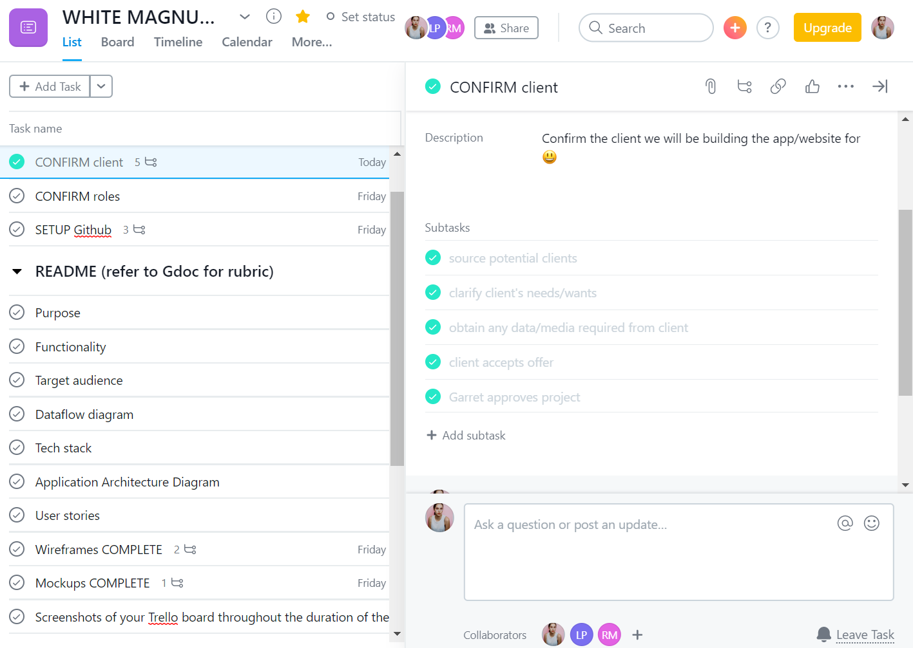

**Assessment**: T3A2 PART A
**Team**: WHITE MAGNUM 
- Cassie
- Luke
- Ragan

***

####Screenshots of your Trello board throughout the duration of the project

We chose [Asana](https://app.asana.com/0/1155724488391785/list) as our project/task manager.

Sections were broken down into **PART A** and **PART B.**

**Part A** contains front and centre tasks for setting up the project and confirming the client, divided into sub tasks for trackable progress and descriptions for clarity on what needs to be done.

**Part A** also contains the requirements for our README (wow, this is meta). As each section is completed, they are ticked off.

**Part B** contains tasks and  related to the programming requirements.