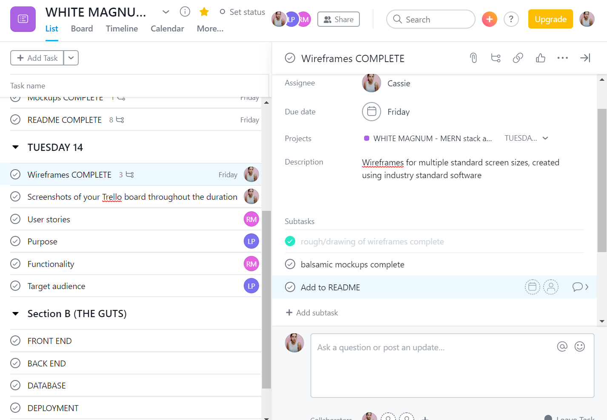
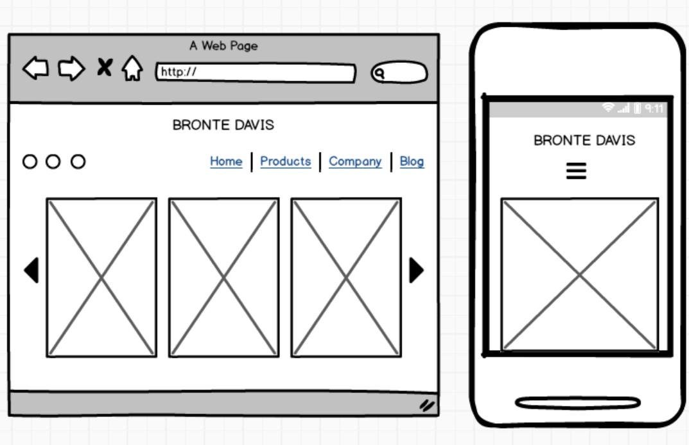
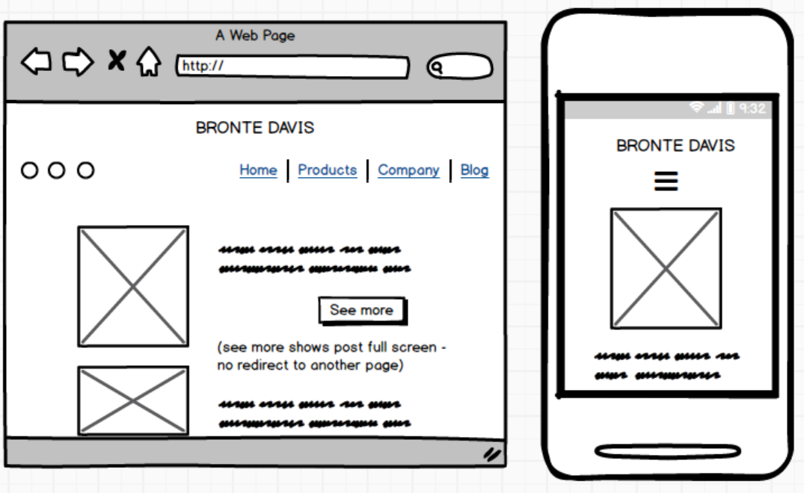
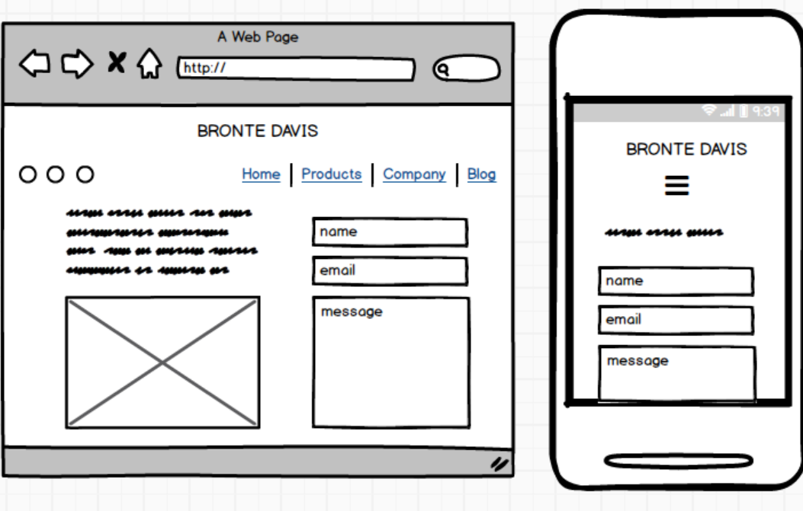
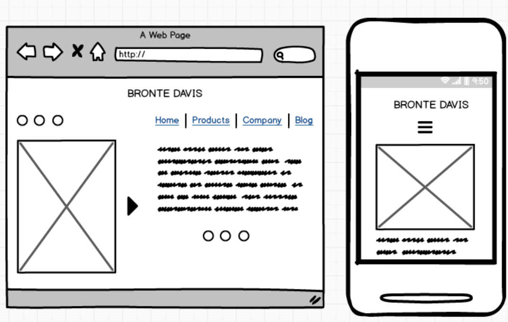
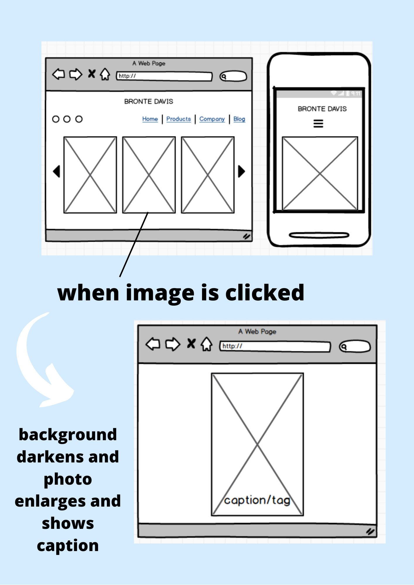
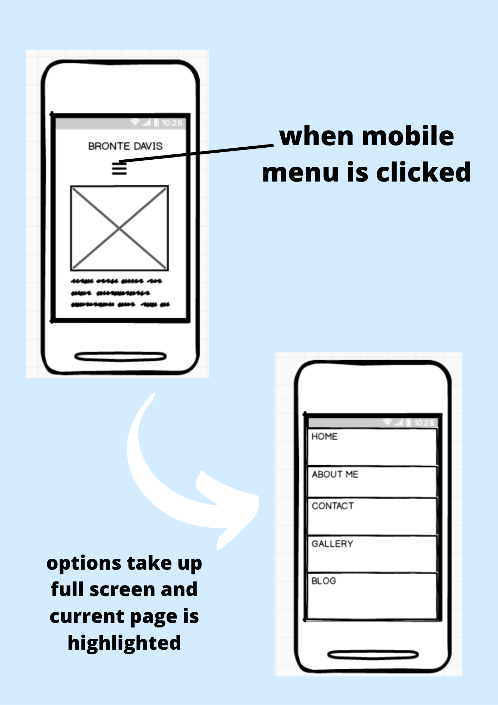

**Assessment**: T3A2 PART A
**Team**: WHITE MAGNUM 
- Cassie
- Luke
- Ragan

***

###Screenshots of your Trello board throughout the duration of the project

We chose [Asana](https://app.asana.com/0/1155724488391785/list) as our project/task manager.

Sections were broken down into **PART A** and **PART B.**

####**Part A** 

Contains front and centre tasks for setting up the project, documentation and confirming the client, divided into sub tasks for trackable progress and descriptions for clarity on what needs to be done.

Part A also contains the requirements for our README (wow, this is meta). As each section is completed, they are ticked off.

It's also been divided into days as we go, to keep track of what we want to accomplish during what timeframe.

####**Part B** 

Contains tasks related to the programming of the project.

This section details client-provided parameters for what should be on each page and the style guidelines.

***

###User Stories

- As Bronte, I would like a portfolio website so I can *showcase my abilities and attract potential clients*. 

- As Bronte, I would like to be able to CRUD my posts/content so that I can *keep my portfolio up to date.* 

- As Bronte, I would like to be able to *log-in as admin* so I can manage my portfolio website 

- As Bronte, I would like to be able to *update my credentials* so I have control over my website

- As Bronte, I would like to be able to *access all client emails sent through the website* so that I can contact them back

- As Bronte, I would like to share information about myself so viewers and *potential clients can know more about me*

- As a potential client, I want to be able to *contact Bronte* so that I can make some business

- As a potential client, I want to be able to *see all of Bronte’s services* so that I can *purchase/book the service* that I need

- As a potential client, I want to be able to *see Bronte’s work* so I can determine if I want her services or not

- As a general browser, I want to be able to read Bronte’s blog posts so I can *keep up to date with what she’s doing*

***

####Wireframes for multiple standard screen sizes, created using industry standard software
HOME

GALLERY

BLOG

CONTACT

ABOUT ME

**INTERACTIONS**

