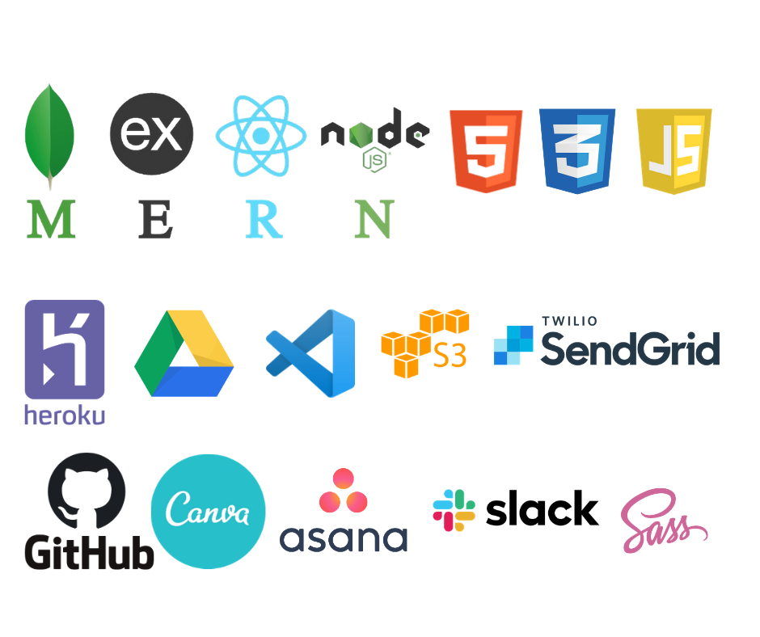

**Assessment**: T3A2 PART A
**Team**: WHITE MAGNUM 
- Cassie
- Luke
- Ragan

***
###Purpose

- Showcase Bronte’s abilities/services
- Attract potential clients
- Keep clients/viewers up to date with Bronte’s activities
- Show Bronte’s contact details for future business

The purpose of Bronte’s portfolio website is to showcase her photography, design services and blog to potential clients and general browsers. The website will be a platform where a potential client can view Bronte’s previous work, browse through her services and be able to contact Bronte for future business. Though the website is looking to generate business the main purpose is to showcase Bronte’s art and life in an online medium. 

The website will present Bronte’s previous work in a way which matches the style of her photography employing a minimalist approach. The purpose of this is to create a frame for Bronte’s art which compliments the photography and entice potential clients/general users to explore the website further. 

The blog component of the website aims to be a platform for self-expression and keeping potential clients/general browsers up-to-date with her current projects and life. The blog will maintain the minimalist theme of the website and be another way to generate interest in Bronte’s life and work. 

***

###Target Audience

- Bronte (client)
- Prospective clients (of Bronte)
- General browsers 

The target audience of the portfolio website is divided into three groups: **Bronte, prospective clients and general browsers.** While the way in which prospective clients and general browsers will consume the website will be similar, Bronte's use of the website will be completely different. 

As the primary user of the website, ***Bronte*** will be the main target audience and given admin access to create, read, update and delete resources from the website. This access is given so Bronte has full control over the published content and provides choice of what she wishes to showcase. The website will be built in a way which allows Bronte to easily add/edit content to provide that choice and improve the maintainability of the website. 

In addition to Bronte, the target audience of the website includes ***prospective clients***. To cater to this audience the website will employ vivid imagery, animations and clear navigation tools to entice prospective clients to explore the website further. Ideally, a prospective client will navigate through the entire website to view Bronte’s work, services, blog and, most importantly, contact details. A contact form will be provided so that a prospective client can fill in their name, contact details and business enquiry so that Bronte can get in touch and discuss the enquiry further.  

The website aims to attract an audience of ***general browsers*** to view Bronte’s art and blog. By employing vivid imagery, animations and clear navigation tools general browsers can easily navigate through the website to view Bronte’s overall style and be interested in her blog. Both prospective clients and general browsers will have read only access rights to protect the integrity of the website’s content. 

***

###Tech stack

***

###Screenshots of your Trello board throughout the duration of the project

We chose [Asana](https://app.asana.com/0/1155724488391785/list) as our project/task manager.

Sections were broken down into **PART A** and **PART B.**

####**Part A** 

Contains front and centre tasks for setting up the project, documentation and confirming the client, divided into sub tasks for trackable progress and descriptions for clarity on what needs to be done.

Part A also contains the requirements for our README (wow, this is meta). As each section is completed, they are ticked off.

It's also been divided into days as we go, to keep track of what we want to accomplish during what timeframe.

####**Part B** 

Contains tasks related to the programming of the project.

Part B contains a checklist of tasks related to the rubric requirements for the project, to ensure we don't stray from the brief.

This section details client-provided parameters for what should be on each page and the style guidelines.

***

###User Stories

- As Bronte, I would like a portfolio website so I can *showcase my abilities and attract potential clients*. 

- As Bronte, I would like to be able to CRUD my posts/content so that I can *keep my portfolio up to date.* 

- As Bronte, I would like to be able to *log-in as admin* so I can manage my portfolio website 

- As Bronte, I would like to be able to *update my credentials* so I have control over my website

- As Bronte, I would like to be able to *access all client emails sent through the website* so that I can contact them back

- As Bronte, I would like to share information about myself so viewers and *potential clients can know more about me*

- As a potential client, I want to be able to *contact Bronte* so that I can make some business

- As a potential client, I want to be able to *see all of Bronte’s services* so that I can *purchase/book the service* that I need

- As a potential client, I want to be able to *see Bronte’s work* so I can determine if I want her services or not

- As a general browser, I want to be able to read Bronte’s blog posts so I can *keep up to date with what she’s doing*

***

####Wireframes for multiple standard screen sizes, created using industry standard software
HOME

GALLERY

BLOG

CONTACT

ABOUT ME

**INTERACTIONS**

